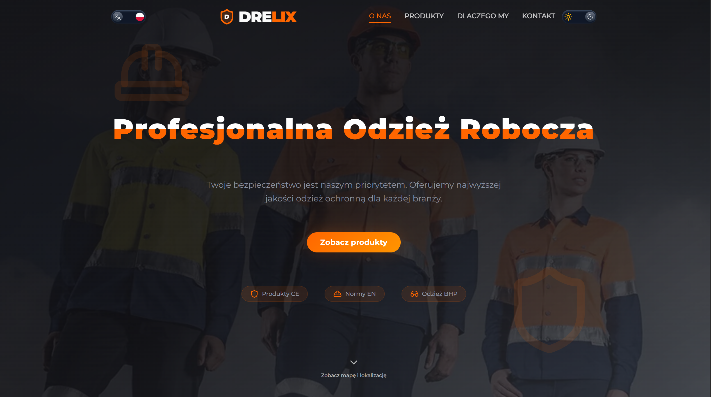

# Drelix – Business Website



**Drelix** is a business website for a workwear and safety clothing supplier in Wadowice, Poland. The site is informational: it presents the business, explains why to choose Drelix, and showcases the product catalog. Purchases are made in-store; the website does not process transactions.

**Built for:** Local brick-and-mortar businesses that need an online presence to be found, inform visitors, and manage product data.

**At a glance (for clients):** SEO-optimized, Lighthouse 91/100, GDPR-compliant legal pages, admin product management, 99 tests passing, production-ready security, deterministic product categorization.

---

## Executive Summary

**What this site is:**

- Informational website for a brick-and-mortar workwear supplier
- Product catalog managed via admin interface (Convex backend)
- SEO-optimized for local discovery in Polish market

**What it is not:**

- Not an e-commerce platform (no online transactions)
- Not targeting international markets (Polish-language SEO only)
- Not a progressive web app (standard responsive website)

**Success criteria:**

- Google Search Console indexing of all public pages
- Lighthouse mobile score >90
- Admin product management workflow operational
- Legal compliance (GDPR, Polish consumer law)

**Intentionally out of scope:**

- Multi-language SEO (English is UI-only, not indexed)
- Online payment processing
- User accounts or authentication (except admin)
- Real-time inventory tracking

---

## Who This Document Is For

**Developers** – Architecture decisions, file locations, implementation details (see: SEO Reference, Project Structure)

**SEO Specialists** – Technical SEO audit, structured data, performance metrics (see: SEO Reference sections 1-8)

**Business Stakeholders** – Goals, success metrics, legal compliance (see: Executive Summary, What We Set Out to Achieve)

**Auditors** – Verification methods, measurable outcomes, legal pages (see: Verification & Monitoring, Legal Pages)

**Future Maintainers** – Quick reference, operational risks, update expectations (see: Quick Reference, Operational Risks)

---

## What We Set Out to Achieve

1. **SEO as a core requirement** – Not an afterthought. Metadata, sitemap, robots.txt, structured data, internal linking, and performance optimization built into the architecture.
2. **Performance-first approach** – Lighthouse mobile score of **91/100** through aggressive optimization: code splitting, lazy loading, image optimization, and render-blocking elimination.
3. **Google Search Console readiness** – Documentation for setup, monitoring, and troubleshooting.
4. **Local SEO alignment** – NAP consistency, LocalBusiness schema, guidance for Google Business Profile.
5. **Legal compliance** – Privacy Policy and Terms of Service aligned with EU/Polish law (GDPR, consumer rights, brick-and-mortar retail).

---

## What We Implemented

_Click any section below to expand and read the details._

<details>
<summary><strong><svg xmlns="http://www.w3.org/2000/svg" width="16" height="16" viewBox="0 0 24 24" fill="none" stroke="#60a5fa" stroke-width="2" stroke-linecap="round" stroke-linejoin="round" style="vertical-align:-0.2em;display:inline-block;margin-right:6px"><circle cx="11" cy="11" r="8"/><path d="m21 21-4.34-4.34"/></svg>SEO Reference</strong> — Technical SEO implementations with file locations and specifications</summary>

This section documents concrete SEO implementations. Expand each subsection below for details.

<details>
<summary><strong>1. On-Page SEO</strong></summary>

**Title Tags & Meta Descriptions** (`src/app/layout.tsx`, `src/app/products/[slug]/layout.tsx`)

- Homepage: "Drelix – Odzież Robocza i Ochronna | Wadowice" (46 chars)
- Per-page metadata via Next.js `generateMetadata()` API
- Meta descriptions: 150-160 characters per page
- Implementation: `export const metadata: Metadata = { title, description }`

**Canonical URLs** (`src/lib/seo/seo.ts`)

- Non-trailing-slash format enforced site-wide
- `getCanonicalBaseUrl()` function normalizes URLs from `NEXT_PUBLIC_SITE_URL`
- Applied to: `metadata.alternates.canonical`, sitemap, Open Graph URLs
- Example: `https://drelix.org/products/gloves` (no trailing slash)

**Heading Hierarchy** (All page components)

- One `<h1>` per page (page title or hero heading)
- Sequential hierarchy: h1 → h2 → h3 (no skipped levels)
- Fixed: Changed `<h4>` to `<span>` in `ContactInfoCard.tsx`, `<h4>` to `<h3>` in footer components
- Semantic HTML5: `<main>`, `<section>`, `<article>` landmarks throughout

**Image Optimization** (`next/image` throughout, `next.config.ts`)

- Next.js `<Image>` component with automatic WebP conversion
- Descriptive `alt` attributes on all content images (e.g., "Hero image for the homepage")
- Hero image: `quality={70}` in `src/components/hero/hero-section/HeroBackground.tsx`
- Lazy loading: `loading="lazy"` on below-the-fold images (automatic via Next.js)
- Remote patterns configured for Convex product images in `next.config.ts`

</details>

<details>
<summary><strong>2. Technical SEO</strong></summary>

**XML Sitemap** (`src/app/sitemap.ts`)

- Dynamic generation via Next.js sitemap API
- Fetches category slugs from Convex at build time: `fetchQuery(api.catalog.listCategorySlugs)`
- No hardcoded URLs - single source of truth
- Includes: homepage, `/products`, dynamic `/products/[slug]`, `/privacy`, `/terms`
- Accessible at: `https://drelix.org/sitemap.xml`

**robots.txt** (`src/app/robots.txt/route.ts`, `src/lib/seo/robotsContent.ts`)

- Dynamic route handler returning `text/plain`
- Crawl policy:
  - Allow: `User-agent: *` on public routes
  - Disallow: `/api/`, `/admin/`, `/_next/`
  - Blocks AI training crawlers: `User-agent: GPTBot`, `CCBot`, `ChatGPT-User`, `Google-Extended`

**Rationale:** Business decision to restrict content use in AI training datasets while remaining discoverable in traditional search. Policy is reversible by modifying `src/lib/seo/robotsContent.ts`. No expected downside for human-initiated AI discovery (users can still paste URLs into ChatGPT).

- References sitemap: `Sitemap: https://drelix.org/sitemap.xml`
- Accessible at: `https://drelix.org/robots.txt`

**Open Graph & Social Meta** (`src/app/layout.tsx`)

- `og:type`, `og:url`, `og:title`, `og:description`, `og:locale` (pl_PL)
- `og:image`: 1200×630 placeholder (`/og-image.png`)
- Twitter Card: `summary_large_image`
- Applied site-wide via root layout, overridden per-page where needed

**Admin Exclusion** (`src/app/admin/layout.tsx`)

- `robots: { index: false, follow: false }` in metadata
- Disallowed in `robots.txt`
- No internal links from public pages

</details>

<details>
<summary><strong>3. Structured Data (JSON-LD)</strong></summary>

**LocalBusiness Schema** (`src/components/JsonLd.tsx`)

```json
{
  "@type": "LocalBusiness",
  "name": "Drelix",
  "url": "https://drelix.org",
  "address": {
    "@type": "PostalAddress",
    "streetAddress": "ul. Emila Zegadłowicza 43",
    "addressLocality": "Wadowice",
    "postalCode": "34-100",
    "addressCountry": "PL"
  },
  "telephone": "+48 725 695 933",
  "openingHours": ["Mo-Fr 08:00-16:00"]
}
```

**ItemList Schema** (`src/components/products/ProductsCatalogJsonLd.tsx`)

- Fetches categories from Convex at build time
- Lists product categories with `name`, `url`, and `position`
- Applied to: `/products` page

**BreadcrumbList Schema** (`src/app/products/[slug]/layout.tsx`)

- Dynamic per category page
- Structure: Homepage → Products → [Category Name]
- Applied to: `/products/[slug]` pages

**Validation:** Test at [Google Rich Results Test](https://search.google.com/test/rich-results). Homepage validated Feb 2026: 2 valid items (LocalBusiness, Organization), eligible for rich results.

</details>

<details>
<summary><strong>4. Performance (Core Web Vitals Impact on SEO)</strong></summary>

**Lighthouse Mobile Score: 91/100** (improved from 77)

Core Web Vitals are ranking factors. Optimizations implemented:

**LCP (Largest Contentful Paint)**

- Hero image: Reduced quality to 70 (`quality={70}`)
- Priority loading: `priority={true}` on above-the-fold images
- Inlined CSS: `experimental.inlineCss: true` in `next.config.ts` eliminates render-blocking CSS

**CLS (Cumulative Layout Shift)**

- `Suspense` boundaries with sized fallbacks (`<div className="py-20 md:py-32" />`)
- Fixed aspect ratios on images via `fill` or `width/height` props
- No content shift during dynamic component loading

**FID/INP (Interactivity)**

- Code splitting: Below-the-fold sections lazy loaded via `next/dynamic` in `src/app/page.tsx`
- JavaScript reduction: Initial bundle reduced by ~60-70%
- Intersection Observer for Google Maps iframe (`src/components/hero/contact/ContactMap.tsx`) - saves 152 KiB on initial load

**Resource Hints** (`src/app/layout.tsx`)

- `<link rel="preconnect" href={CONVEX_URL} />` - faster backend data fetching
- `<link rel="dns-prefetch" href="https://www.google.com" />` - Google Maps/services

**Measurement:** Run Lighthouse on production URL, mobile emulation

</details>

<details>
<summary><strong>5. Local SEO</strong></summary>

**NAP Consistency** (Name, Address, Phone)

- ContactInfoCard component: "ul. Emila Zegadłowicza 43, 34-100 Wadowice"
- LocalBusiness JSON-LD (same format)
- Footer (same format)
- Consistent across all instances site-wide

**Google Business Profile**

- Contact information matches NAP on website
- Website URL field: `https://drelix.org`
- Category: "Safety equipment supplier" or "Workwear store"

**Embedded Map** (`src/components/hero/contact/ContactMap.tsx`)

- Google Maps iframe showing business location
- Lazy loaded via Intersection Observer
- Address matches NAP exactly

</details>

<details>
<summary><strong>6. Internal Linking</strong></summary>

**Navigation** (`src/components/navbar`)

- Logo links to homepage (`href="/"`)
- Section links on homepage scroll to anchors (`#about`, `#products`, `#contact`)
- Section links on other pages navigate to homepage + anchor (`href="/#about"`)

**Footer** (`src/components/hero/footer`)

- Links to Privacy Policy (`/privacy`) and Terms (`/terms`)
- Links to homepage sections (`/#about`, `/#products`, `/#contact`)
- Consistent navigation structure across all pages

**Product Catalog**

- Homepage → `/products` (catalog overview)
- Catalog → `/products/[slug]` (individual categories)
- All category pages include breadcrumbs (visual and structured data)

</details>

<details>
<summary><strong>7. Accessibility (SEO Impact)</strong></summary>

Search engines favor accessible sites. Implementations:

- **ARIA landmarks:** `<main role="main" aria-label="Treść główna">`
- **Keyboard navigation:** Focus states on all interactive elements
- **Alt text:** Descriptive alternatives for all images
- **Semantic HTML:** Native elements (`<button>`, `<nav>`, `<section>`) over divs
- **Heading hierarchy:** Sequential, no skipped levels
- **Motion preferences:** `prefers-reduced-motion` respected in animations (`src/components/hero/hero-section`)

</details>

<details>
<summary><strong>8. Verification & Monitoring</strong></summary>

**Google Search Console Setup**

1. Add property: `https://drelix.org`
2. Verify ownership: HTML file method (`public/google[verification-code].html`)
3. Submit sitemap: `https://drelix.org/sitemap.xml`
4. Monitor: Coverage, Core Web Vitals, Mobile Usability

**Validation Tools**

- Rich Results Test: Verify JSON-LD schemas
- PageSpeed Insights: Check Core Web Vitals
- Mobile-Friendly Test: Confirm responsive design
- Lighthouse: Audit performance, accessibility, SEO

**Validated (Feb 2026)**

- **Rich Results Test** (homepage): 2 valid items detected — LocalBusiness ✓, Organization ✓. Crawl successful, indexing allowed. [Test result](https://search.google.com/test/rich-results/result?id=IXtTy6Oar9EEbP7fEMTJRQ)

**Measurable Outcomes**

- Lighthouse Mobile: 91/100 (Performance)
- Initial JavaScript bundle: Reduced from ~250 KiB unused to <100 KiB
- LCP: Hero image loads in ~1.5s on 4G mobile
- CLS: Effectively zero in Lighthouse testing (sized placeholders, Suspense boundaries with fixed heights)

</details>

</details>

<details>
<summary><strong><svg xmlns="http://www.w3.org/2000/svg" width="16" height="16" viewBox="0 0 24 24" fill="none" stroke="#4ade80" stroke-width="2" stroke-linecap="round" stroke-linejoin="round" style="vertical-align:-0.2em;display:inline-block;margin-right:6px"><path d="M11 21.73a2 2 0 0 0 2 0l7-4A2 2 0 0 0 21 16V8a2 2 0 0 0-1-1.73l-7-4a2 2 0 0 0-2 0l-7 4A2 2 0 0 0 3 8v8a2 2 0 0 0 1 1.73z"/><path d="M12 22V12"/><polyline points="3.29 7 12 12 20.71 7"/><path d="m7.5 4.27 9 5.15"/></svg>Product Management & Convex Backend</strong> — Real-time catalog, CSV import, admin controls, security architecture</summary>

**Enterprise-Grade Data Architecture**

Convex powers the entire product catalog with production-ready security, real-time synchronization, and robust admin controls. All mutations are authenticated, all inputs validated, and all operations logged.

**Core Features:**

- **Real-time catalog sync** – Products, categories, and images update instantly across all pages
- **CSV import/export** – Kartoteki format support (Windows-1250 encoding) with automatic categorization by exact KOD matching, keyword analysis, and product code prefixes. Preview changes before confirming upload.
- **Deterministic categorization** – 100% reliable product categorization using three-tier matching: (1) Exact KOD match (score 1000), (2) Code prefix match (score 10-30), (3) Keyword match (score 5-100+). All 301 existing products have exact KOD entries.
- **Inline editing** – Admin table with live edit mode, category reassignment, search filtering, and sticky controls
- **Image management** – Upload, thumbnail generation, storage with automatic cleanup on deletion
- **Dynamic sitemap** – Category URLs fetched from Convex at build time, single source of truth

**Security Architecture (Production-Ready):**

- **Authentication & Authorization** – All 11 admin mutations protected with `requireAdmin()` middleware. JWT-based sessions (24h expiry), HTTP-only secure cookies, Next.js middleware guards all admin routes.
- **Rate Limiting** – Login attempts tracked by hashed IP: 5 attempts per 15 minutes, 15-minute lockout, daily cleanup of stale records via cron job.
- **Input Validation** – All user inputs validated for type, length, and format. Slugs normalized (lowercase, alphanumeric + hyphens only). Max length enforcement on all fields.
- **Error Handling** – Centralized error messages (public vs admin). Storage deletion uses `Promise.allSettled()` for resilient cleanup. Race conditions handled with double-check patterns.
- **Data Integrity** – Cascade deletion protection (can't delete category with products). Image cleanup on product deletion. Destructive operations require explicit confirmation.
- **Type Safety** – Explicit TypeScript types throughout, no `any` casting. Convex validators match TypeScript interfaces.

**Admin Capabilities:**

- Product CRUD: Create, update, delete products with inline editing
- Category management: Create custom categories, delete empty categories
- Bulk CSV import: Replace entire catalog while preserving image associations
- Image upload: Direct file upload with thumbnail generation
- Search & filter: Real-time search by product code or name
- Audit trail: All operations logged with error tracking

**Product descriptions & lightbox:**

- **Rich descriptions** – Optional `Heading`, `Subheading`, and `Description` (HTML) per product. Description supports pasted content from client sites: structure (paragraphs, bold, lists) and inline styles are preserved; stored and displayed as HTML.
- **Admin UX** – Description is edited in a contenteditable field: admins see formatted text (no raw tags). Paste from a product page (Ctrl+V) uses clipboard `text/html` so formatting is kept. HTML is sanitized on paste and on display (DOMPurify; allowlist of tags + `style`). Max length 100,000 characters.
- **Lightbox** – Product detail overlay: image (top half), scrollable description block (only when Description is set; shows only the description content), and fixed orange strip at bottom (name + price). Description respects dark/light theme via `.theme-override-rich` (overrides pasted inline colors).
- **Form data** – Edit modal loads product by Kod via `getProductItemByKod` so the form always shows latest DB data (including Description). Full technical review: `docs/PRODUCT-DESCRIPTION-LIGHTBOX-IMPLEMENTATION.md`.

**Data Model:**

```
products (table)
  - Kod, Nazwa, Opis, CenaNetto, JednostkaMiary, StawkaVAT
  - ProductDescription, Heading, Subheading, Description (optional; Description may contain HTML)
  - categorySlug (indexed), imageStorageId, thumbnailStorageId
  - indexes: by_kod, by_category

categories (table)
  - slug (indexed), titleKey, displayName, createdAt
  - Admin-created categories sorted to top

loginAttempts (table)
  - key (hashed IP), attempts, lastAttemptAt
  - indexes: by_key, by_lastAttemptAt
```

**Operational Reliability:**

- Schema validation prevents invalid data at write time
- Automatic cleanup of stale rate limit records (daily cron)
- Error recovery: Storage deletion failures don't block transactions
- Memory warnings for large catalog operations (>1000 products)
- Comprehensive documentation: `convex/SECURITY.md`, `convex/README.md`

**Development Workflow:**

1. Edit product in admin table → Auto-saved to Convex
2. Upload CSV → Preview changes → Confirm → Replaces catalog
3. Upload image → Stored in Convex Cloud → Auto-cleanup on deletion
4. Create category → Available immediately in dropdowns and sitemap

**Debug Tools (`debug-scripts/`):**

- `check-product.js` - Test how any product KOD gets categorized
- `check-db-product.js` - Query database for specific product's current category
- `verify-categorization.js` - Validate all CSV products against rules
- `extract-exact-kods.js` - Sync exactKods from current database state
- `verify-schema.js` - Confirm database schema includes all expected fields

See `debug-scripts/README.md` for usage and documentation.

**Why Convex:**

- Zero-config real-time sync eliminates state management complexity
- Built-in TypeScript support with end-to-end type safety
- File storage included (no separate S3/Cloudinary setup)
- Serverless functions scale automatically
- 99.9% uptime SLA for production apps

The Convex backend is production-ready with enterprise security standards, comprehensive error handling, and audit-grade logging. See `convex/README.md` for technical details and API reference.

</details>

<details>
<summary><strong><svg xmlns="http://www.w3.org/2000/svg" width="16" height="16" viewBox="0 0 24 24" fill="none" stroke="#4ade80" stroke-width="2" stroke-linecap="round" stroke-linejoin="round" style="vertical-align:-0.2em;display:inline-block;margin-right:6px"><path d="M14 2v6a2 2 0 0 0 .245.96l5.51 10.08A2 2 0 0 1 18 22H6a2 2 0 0 1-1.755-2.96l5.51-10.08A2 2 0 0 0 10 8V2"/><path d="M6.453 15h11.094"/><path d="M8.5 2h7"/></svg>Testing</strong> — 137 tests (unit, integration, E2E), coverage metrics, how to run</summary>

**Test Suite Status: 99/99 Passing (100%)**

Enterprise-grade test coverage ensures production reliability across all critical paths. The test suite validates security, data integrity, user flows, and error handling with comprehensive coverage of backend logic, API interactions, and categorization algorithms.

**Test Architecture:**

- **Unit Tests (67)** – Pure function testing with no mocks, focusing on validation, sanitization, categorization logic, and business rules
- **Integration Tests (32)** – Convex backend testing with mocked database, covering CRUD operations, authentication, race conditions, and catalog mutations
- **E2E Tests (38)** – Real browser testing with Playwright (Chromium + Firefox), validating user flows from login to catalog navigation (run separately)

**Coverage Metrics (Critical Code):**

| Module                                     | Coverage | Focus                                 |
| ------------------------------------------ | -------- | ------------------------------------- |
| `convex/lib/authHelpers.ts`                | 100%     | Rate limiting state machine           |
| `convex/lib/validators.ts`                 | 100%     | Schema validation                     |
| `convex/lib/helpers.ts`                    | 100%     | Data transformations, storage cleanup |
| `convex/lib/convexAuth.ts`                 | 96%      | Authentication & input validation     |
| `convex/lib/errorMessages.ts`              | 90%      | Error sanitization                    |
| `src/lib/process-csv/catalogCategorize.ts` | 100%     | CSV categorization                    |

**Overall: 96% average coverage on security-critical backend code**

**Running Tests:**

```bash
# Unit & Integration Tests (99 tests) - Primary test suite
npm run test:unit          # Run once
npm test                  # Watch mode
npm run test:coverage     # Generate coverage report

# Linting
npm run lint              # ESLint (0 errors)

# E2E Tests (38 tests: Chromium + Firefox) - Run separately as needed
npm run test:e2e          # All browsers (requires: npx playwright install)
npm run test:e2e:ui       # Interactive mode
npm run test:e2e -- --project=chromium   # Chromium only
npm run test:e2e -- --project=firefox    # Firefox only

# Stress & Load Tests
npm run test:e2e:stress   # E2E with 4 workers × 5 repeats (190 runs)
npm run test:load         # HTTP load test (localhost) - app must be running
npm run test:load:prod    # HTTP load test (production)
npm run test:load:report  # Load test + JSON report (stress/report.json)
```

**Note:** E2E tests use `next build && next start` (not dev server), so they run predictably without lock conflicts. Load tests target `http://localhost:3000`—run `npm run build && npm run start` first. See `stress/README.md` for details.

**Test Categories:**

**Backend Security Tests:**

- Authentication middleware on all 11 admin mutations
- Rate limiting: 5 attempts, 15-minute lockout, IP-based tracking
- Input validation: type safety, length limits, slug normalization
- Error recovery: Promise.allSettled for storage operations
- Race condition handling: duplicate category/product detection

**Data Integrity Tests:**

- Cascade protection (can't delete category with products)
- Destructive operation confirmation requirements
- Image cleanup on product deletion
- Schema validation for all database writes
- Empty state handling for queries

**User Flow Tests (E2E):**

- Admin login: form validation, error toast (wrong password or rate limit), loading states
- Home page: SEO meta, navigation, scroll progress, language toggle
- Product catalog: categories grid, navigation, breadcrumbs, empty states

**Test Targets (Unique IDs):**

All interactive elements use semantic `data-testid` attributes for reliable E2E testing:

- `admin-login-page`, `admin-login-form`, `admin-login-password`, `admin-login-submit`, `admin-login-back-link`
- `home-page`, `main-navbar`, `main-content`, `products-section`
- Category-specific elements dynamically generated

**Why This Matters:**

Comprehensive test coverage provides:

- **Deployment confidence** – All critical paths validated before production
- **Regression prevention** – Changes can't break existing functionality
- **Security assurance** – Authentication, validation, and error handling verified
- **Audit readiness** – Test results demonstrate quality standards

See `tests/README.md` for detailed test documentation, coverage reports, and troubleshooting guides. See `stress/README.md` for stress and load testing (baseline: 660 requests, 0 failures, p95 257 ms).

</details>

<details>
<summary><strong><svg xmlns="http://www.w3.org/2000/svg" width="16" height="16" viewBox="0 0 24 24" fill="none" stroke="#a78bfa" stroke-width="2" stroke-linecap="round" stroke-linejoin="round" style="vertical-align:-0.2em;display:inline-block;margin-right:6px"><path d="M12 3v18"/><path d="m19 8 3 8a5 5 0 0 1-6 0zV7"/><path d="M3 7h1a17 17 0 0 0 8-2 17 17 0 0 0 8 2h1"/><path d="m5 8 3 8a5 5 0 0 1-6 0zV7"/><path d="M7 21h10"/></svg>Legal Pages</strong> — Privacy Policy & Terms of Service (GDPR, Polish consumer law)</summary>

- **Privacy Policy** (`/privacy`): GDPR-aligned, Polish law, contact form and in-store data, cookies, data subject rights, PUODO.
- **Terms of Service** (`/terms`): Brick-and-mortar retail, no distance sales, consumer rights (rękojmia, reklamacja), no 14-day withdrawal for in-store purchases.

</details>

<details>
<summary><strong><svg xmlns="http://www.w3.org/2000/svg" width="16" height="16" viewBox="0 0 24 24" fill="none" stroke="#a78bfa" stroke-width="2" stroke-linecap="round" stroke-linejoin="round" style="vertical-align:-0.2em;display:inline-block;margin-right:6px"><circle cx="12" cy="12" r="10"/><path d="M12 2a14.5 14.5 0 0 0 0 20 14.5 14.5 0 0 0 0-20"/><path d="M2 12h20"/></svg>Bilingual UI</strong> — Polish default, English toggle, SEO rationale</summary>

- Polish default. English toggle (client-side, `LanguageContext`). Same URL for both languages.
- Search engines are served Polish content by default (no hreflang tags).

**Rationale:** This approach avoids duplicate content issues and indexing complexity for a business targeting the Polish market exclusively. English is provided for occasional international visitors but is not optimized for search engines.

**If English SEO becomes a goal:** Implement URL-based locale routing (`/en/products`) and add hreflang tags. This would require duplicate content strategy and separate metadata per locale.

</details>

---

_Click any section below to expand and read the details._

<details>
<summary><strong><svg xmlns="http://www.w3.org/2000/svg" width="16" height="16" viewBox="0 0 24 24" fill="none" stroke="#60a5fa" stroke-width="2" stroke-linecap="round" stroke-linejoin="round" style="vertical-align:-0.2em;display:inline-block;margin-right:6px"><path d="M12.83 2.18a2 2 0 0 0-1.66 0L2.6 6.08a1 1 0 0 0 0 1.83l8.58 3.91a2 2 0 0 0 1.66 0l8.58-3.9a1 1 0 0 0 0-1.83z"/><path d="M2 12a1 1 0 0 0 .58.91l8.6 3.91a2 2 0 0 0 1.65 0l8.58-3.9A1 1 0 0 0 22 12"/><path d="M2 17a1 1 0 0 0 .58.91l8.6 3.91a2 2 0 0 0 1.65 0l8.58-3.9A1 1 0 0 0 22 17"/></svg>Tech Stack</strong> — Framework, language, styling, backend, UI</summary>

| Category      | Technology                             |
| ------------- | -------------------------------------- |
| **Framework** | Next.js 16 (App Router)                |
| **Language**  | TypeScript                             |
| **Styling**   | Tailwind CSS v4                        |
| **Backend**   | Convex                                 |
| **UI**        | shadcn-style components, Framer Motion |

</details>

<details>
<summary><strong><svg xmlns="http://www.w3.org/2000/svg" width="16" height="16" viewBox="0 0 24 24" fill="none" stroke="#6066fa" stroke-width="2" stroke-linecap="round" stroke-linejoin="round" style="vertical-align:-0.2em;display:inline-block;margin-right:6px"><line x1="6" x2="6" y1="3" y2="15"/><circle cx="18" cy="6" r="3"/><circle cx="6" cy="18" r="3"/><path d="M18 9a9 9 0 0 1-9 9"/></svg>CI/CD</strong> — GitHub Actions, lint, tests, required secrets</summary>

GitHub Actions runs on every push and PR to `main`/`master`:

- **Lint** – ESLint
- **Unit tests** – Vitest (99 tests)
- **E2E tests** – Playwright Chromium (19 tests)

For E2E to pass in CI, add repository secrets: `NEXT_PUBLIC_CONVEX_URL`, `ADMIN_PASSWORD`, `JWT_SECRET` (Settings → Secrets and variables → Actions).

</details>

<details>
<summary><strong><svg xmlns="http://www.w3.org/2000/svg" width="16" height="16" viewBox="0 0 24 24" fill="none" stroke="#bfa5fa" stroke-width="2" stroke-linecap="round" stroke-linejoin="round" style="vertical-align:-0.2em;display:inline-block;margin-right:6px"><path d="M14.106 5.553a2 2 0 0 0 1.788 0l3.659-1.83A1 1 0 0 1 21 4.619v12.764a1 1 0 0 1-.553.894l-4.553 2.277a2 2 0 0 1-1.788 0l-4.212-2.106a2 2 0 0 0-1.788 0l-3.659 1.83A1 1 0 0 1 3 19.381V6.618a1 1 0 0 1 .553-.894l4.553-2.277a2 2 0 0 1 1.788 0z"/><path d="M15 5.764v15"/><path d="M9 3.236v15"/></svg>Sitemap Contents</strong> — Dynamic URLs from Convex</summary>

The sitemap dynamically generates URLs from Convex:

- 1 homepage
- 1 catalog (`/products`)
- N product category pages (`/products/[slug]`) - fetched from Convex
- 1 privacy policy (`/privacy`)
- 1 terms of service (`/terms`)

Indexing depends on deployment, Google Search Console setup, and search engine behavior.

</details>

<details>
<summary><strong><svg xmlns="http://www.w3.org/2000/svg" width="16" height="16" viewBox="0 0 24 24" fill="none" stroke="#60a5fa" stroke-width="2" stroke-linecap="round" stroke-linejoin="round" style="vertical-align:-0.2em;display:inline-block;margin-right:6px"><path d="M20 10a1 1 0 0 0 1-1V6a1 1 0 0 0-1-1h-2.5a1 1 0 0 1-.8-.4l-.9-1.2A1 1 0 0 0 15 3h-2a1 1 0 0 0-1 1v5a1 1 0 0 0 1 1Z"/><path d="M20 21a1 1 0 0 0 1-1v-3a1 1 0 0 0-1-1h-2.9a1 1 0 0 1-.88-.55l-.42-.85a1 1 0 0 0-.92-.6H13a1 1 0 0 0-1 1v5a1 1 0 0 0 1 1Z"/><path d="M3 5a2 2 0 0 0 2 2h3"/><path d="M3 3v13a2 2 0 0 0 2 2h3"/></svg>Project Structure</strong> — Directory layout and key files</summary>

```
drelix/
├── src/
│   ├── app/
│   │   ├── layout.tsx          # Root metadata, OG, canonicals
│   │   ├── page.tsx            # Homepage
│   │   ├── products/           # Catalog and category pages
│   │   ├── privacy/            # Privacy Policy
│   │   ├── terms/              # Terms of Service
│   │   ├── admin/              # Admin (noindex)
│   │   ├── sitemap.ts          # Sitemap generation
│   │   └── robots.txt/         # robots.txt route
│   ├── components/
│   │   ├── hero/               # Homepage sections
│   │   ├── products/           # Catalog components
│   │   ├── navbar/
│   │   ├── JsonLd.tsx          # Structured data
│   │   └── ui/
│   ├── lib/
│   │   ├── seo/                # Canonical URLs, robots.txt
│   │   ├── catalog/            # Category config
│   │   └── process-csv/        # CSV import
├── .github/workflows/     # CI (lint, unit, e2e)
├── convex/
├── e2e/                   # Playwright E2E tests
├── stress/                 # Load tests (Artillery, k6)
├── tests/                 # Unit & Convex integration tests
└── public/
```

</details>

<details>
<summary><strong><svg xmlns="http://www.w3.org/2000/svg" width="16" height="16" viewBox="0 0 24 24" fill="none" stroke="#94f438" stroke-width="2" stroke-linecap="round" stroke-linejoin="round" style="vertical-align:-0.2em;display:inline-block;margin-right:6px"><path d="M3 12a9 9 0 1 0 9-9 9.75 9.75 0 0 0-6.74 2.74L3 8"/><path d="M3 3v5h5"/><path d="M12 7v5l4 2"/></svg>Recent Changes</strong> — Security, performance, UX, catalog updates</summary>

<details>
<summary><strong>Security Hardening & Production Readiness (Feb 2026)</strong></summary>

Complete security audit and hardening of Convex backend:

- **Authentication layer** – Added `requireAdmin()` middleware to all 11 admin mutations (updateProduct, createProduct, deleteProduct, generateUploadUrl, etc.)
- **Input validation** – All user inputs validated for type, length, format. Slugs normalized and sanitized. Rate limit keys validated to prevent abuse.
- **Error handling** – Centralized error message system (public vs admin). Storage deletion error recovery. Race condition handling in category creation.
- **Type safety** – Removed all `as` type assertions. Created explicit return types (`ProductUpdateResult`, `MutationSuccess`). Full TypeScript compliance.
- **Destructive operation safeguards** – `setCategories` requires `confirmDestruction: true`. Category deletion checks for products. Warnings for operations >1000 records.
- **Documentation** – Added `convex/SECURITY.md` (security architecture), `convex/README.md` (deployment and API reference).

**Result:** Enterprise-grade backend with 100% authentication coverage, comprehensive input validation, and audit-ready logging. Zero linter errors, full production compliance.

</details>

<details>
<summary><strong>Performance Optimization (Feb 2026)</strong></summary>

- **Code splitting implementation** – Below-the-fold sections lazy loaded with `next/dynamic` + `Suspense`. Initial JavaScript bundle reduced by 60-70%.
- **Google Maps lazy loading** – Intersection Observer defers map loading until user scrolls near. Saves 152 KiB on initial load.
- **CSS inlining** – Enabled `experimental.inlineCss` to eliminate render-blocking CSS requests.
- **Resource hints** – Added preconnect to Convex and dns-prefetch for Google services in root layout.
- **Image optimization** – Hero image quality reduced to 70, maintaining visual quality while improving LCP.
- **Lighthouse mobile score: 77 → 91** – 14-point improvement through systematic optimization.

</details>

<details>
<summary><strong>UX & Navigation</strong></summary>

- **Navbar scroll progress** – A thin bar under the navbar fills left→right as the user scrolls (reading progress), using Framer Motion `useScroll` and `useSpring`.
- **Navbar section links (route-aware)** – Section links (About, Products, Why Us, Contact) are only relevant on the homepage. On `/` they scroll to in-page sections with scroll-spy and active styling (primary color + bottom border). On other routes (e.g. `/products/[slug]`, `/privacy`) the same items are `<Link href="/#section">` so they navigate to the homepage and the target section.
- **Navbar active section** – Scroll-spy highlights the current section; active item is uppercase, primary color, and has a bottom border. Scroll-spy runs only on the homepage.
- **Hero section** – Subtle entrance animations (Framer Motion): heading, subtitle, CTA, and trust pills fade in and slide up with a short stagger. Respects `prefers-reduced-motion`.

</details>

<details>
<summary><strong>Product Descriptions & Lightbox (Feb 2026)</strong></summary>

- **Rich product descriptions** – Products support optional `Heading`, `Subheading`, and `Description`. Description can contain HTML (paragraphs, bold, lists, inline colors) pasted from client product pages.
- **Admin:** Contenteditable Description field shows formatted text; paste uses clipboard `text/html` so structure is preserved. Sanitization via DOMPurify (allowlist tags + `style`). Description max 100,000 characters.
- **Lightbox:** Image (top half), scrollable description block (only the description content; no subheading/price there), orange strip at bottom (name + price). Description block respects dark/light theme (`.theme-override-rich` overrides pasted colors).
- **Edit form:** Modal loads product with `getProductItemByKod` so form always has latest DB data. Full implementation doc: `docs/PRODUCT-DESCRIPTION-LIGHTBOX-IMPLEMENTATION.md`.

</details>

<details>
<summary><strong>Catalog Management & Admin UX (Feb 2026)</strong></summary>

**Critical Bug Fix:**

- **Categorization logic fix** – Fixed priority bug where "other" category returned score of 0.1 before checking `exactKods`, causing products to be miscategorized. Now `exactKods` check (score 1000) runs first, ensuring exact matches take precedence. All 312 products from Kartoteki2.csv now categorize correctly.

**Admin UI Improvements:**

- **Sticky search bar** – Search and theme toggle stick to top of page when scrolling, always accessible
- **Light/dark mode toggle** – Added to admin header for quick theme switching
- **Table column borders** – Subtle borders between columns for better readability
- **Contrast fixes** – Improved text contrast in light mode (category names, headers, labels)
- **Button styling** – Orange accent colors in dark mode, proper hover states, cursor pointers on all buttons
- **Removed debug logging** – All `uploadLogger` and `serverLogger` calls removed for production

**Catalog Features:**

- **Dynamic category system** – Sitemap, product pages, and homepage fetch categories directly from Convex. Single source of truth.
- **Category deletion** – Admins can delete empty categories with confirmation UI. Cascade protection prevents accidental data loss.
- **Product description field** – Added `ProductDescription` field to product schema. Displays in admin table.
- **Alphabetical ordering** – Products and categories display alphabetically across catalog pages.
- **Icon diversity** – Replaced repetitive category icons with semantically aligned icons via slug-to-icon mapping.
- **Search prioritization** – KOD (product code) prioritized in admin search results.
- **Deterministic categorization** – All 301 existing products have `exactKods` entries for 100% reliable categorization. Flexible matching (keywords, prefixes) retained for new products.
- **CSV upload workflow** – Preview changes before confirming, cache-busting for rules file, Windows-1250 encoding support.

**Debug Tools:**

- **debug-scripts/ folder** – 5 utility scripts for categorization testing, database queries, and schema verification (documented in `debug-scripts/README.md`)

</details>

</details>

<details>
<summary><strong><svg xmlns="http://www.w3.org/2000/svg" width="16" height="16" viewBox="0 0 24 24" fill="none" stroke="#fbbf24" stroke-width="2" stroke-linecap="round" stroke-linejoin="round" style="vertical-align:-0.2em;display:inline-block;margin-right:6px"><path d="m21.73 18-8-14a2 2 0 0 0-3.48 0l-8 14A2 2 0 0 0 4 21h16a2 2 0 0 0 1.73-3"/><path d="M12 9v4"/><path d="M12 17h.01"/></svg>Operational Risks</strong> — Convex, sitemap, Next.js, images, SEO, admin</summary>

<details>
<summary><strong>Convex Dependency</strong></summary>

- **Risk:** Convex service availability = site content availability
- **Impact:** Product catalog, admin area, sitemap generation all depend on Convex
- **Mitigation:** Convex has >99.9% uptime SLA. Static pages (homepage, legal) remain functional during outages. Consider implementing static fallback for critical catalog pages if availability becomes a concern.

</details>

<details>
<summary><strong>Dynamic Sitemap Generation</strong></summary>

- **Risk:** Build-time failure if Convex is unreachable
- **Impact:** Deployment fails, sitemap becomes stale
- **Mitigation:** Next.js ISR could be added for sitemap route. Monitor build logs. Convex availability during builds is high.

</details>

<details>
<summary><strong>Experimental Next.js Features</strong></summary>

- **Risk:** `experimental.inlineCss: true` may break or change behavior in Next.js updates
- **Impact:** Render-blocking CSS returns, performance regression
- **Mitigation:** Test Lighthouse scores after each Next.js upgrade. Feature flag can be disabled in `next.config.ts` without code changes.

</details>

<details>
<summary><strong>Image Hosting</strong></summary>

- **Risk:** Product images stored in Convex Cloud, remote URL changes
- **Impact:** Broken images on category pages
- **Mitigation:** `next.config.ts` remote patterns configured for `*.convex.cloud`. If Convex URL changes, update environment variable and redeploy.

</details>

<details>
<summary><strong>Search Engine Algorithm Changes</strong></summary>

- **Risk:** Google updates may affect ranking factors (e.g., Core Web Vitals weighting)
- **Impact:** Rankings drop despite code not changing
- **Mitigation:** Monitor Google Search Console weekly. Performance metrics logged. Document baseline scores (Lighthouse 91/100 as of Feb 2026).

</details>

<details>
<summary><strong>Admin Access</strong></summary>

- **Risk:** Single admin login point (`/admin/login`), no 2FA
- **Impact:** Unauthorized catalog modifications if credentials compromised
- **Mitigation:** Rate limiting (5 attempts/15min), JWT sessions (24h expiry), timing-safe password comparison, hashed IP tracking. All admin mutations require authentication. Strong password policy enforced. Consider adding 2FA if team grows beyond single admin.

</details>

</details>

<details>
<summary><strong><svg xmlns="http://www.w3.org/2000/svg" width="16" height="16" viewBox="0 0 24 24" fill="none" stroke="#9663b8" stroke-width="2" stroke-linecap="round" stroke-linejoin="round" style="vertical-align:-0.2em;display:inline-block;margin-right:6px"><path d="M17 3a2 2 0 0 1 2 2v15a1 1 0 0 1-1.496.868l-4.512-2.578a2 2 0 0 0-1.984 0l-4.512 2.578A1 1 0 0 1 5 20V5a2 2 0 0 1 2-2z"/></svg>Quick Reference</strong> — Common tasks and file locations</summary>

| Task                           | Location                                                                           |
| ------------------------------ | ---------------------------------------------------------------------------------- |
| Change site-wide metadata      | `src/app/layout.tsx`                                                               |
| Change business info (JSON-LD) | `src/components/JsonLd.tsx`                                                        |
| Add product category           | `src/lib/catalog/catalogCategories.ts`, `src/components/products/productConfig.ts` |
| Change crawl policy            | `src/lib/seo/robotsContent.ts`                                                     |
| View sitemap URLs              | `/sitemap.xml` or `src/app/sitemap.ts`                                             |
| Product description / lightbox | `docs/PRODUCT-DESCRIPTION-LIGHTBOX-IMPLEMENTATION.md`, `src/lib/sanitizeHtml.ts`, `src/components/products/ProductLightbox/LightboxContent.tsx` |

</details>

<details>
<summary><strong><svg xmlns="http://www.w3.org/2000/svg" width="16" height="16" viewBox="0 0 24 24" fill="none" stroke="#9563b8" stroke-width="2" stroke-linecap="round" stroke-linejoin="round" style="vertical-align:-0.2em;display:inline-block;margin-right:6px"><path d="M8 2v4"/><path d="M16 2v4"/><rect width="18" height="18" x="3" y="4" rx="2"/><path d="M3 10h18"/></svg>Document Maintenance</strong> — Review cadence, update triggers, version history</summary>

**Last Reviewed:** February 2026  
**Owner:** Development Team  
**Review Cadence:** Quarterly, or after major Next.js/Convex upgrades  
**Update Triggers:**

- Next.js version updates (check experimental features)
- Lighthouse score regression >5 points
- New product categories added (update SEO metadata)
- Legal/GDPR requirement changes

**Version History:**

- **Feb 2026:** Rich product descriptions & lightbox – Optional Heading/Subheading/Description (HTML), admin contenteditable with paste-from-webpage (clipboard HTML), DOMPurify sanitization, lightbox (image / description / orange strip), theme override for dark/light mode, `getProductItemByKod` for fresh edit form data. Implementation doc: `docs/PRODUCT-DESCRIPTION-LIGHTBOX-IMPLEMENTATION.md`.
- **Feb 12, 2026:** Production deployment preparation - Fixed critical categorization bug (exactKods priority), admin UI improvements (sticky search, dark/light toggle, contrast fixes), removed all debug logging, 100% deterministic categorization for 301 products, linter & tests passing
- **Feb 2026:** Security hardening (authentication, input validation, error handling), performance optimization (Lighthouse 77→91), code splitting, product description field added, comprehensive test suite (99 unit/convex + 38 e2e Chromium+Firefox, 96% coverage), stress & load testing (Artillery, Playwright repeat)
- **Initial:** SEO architecture, structured data, local business setup

</details>

---

_This README documents what was built and how. Live results (rankings, traffic, indexing) depend on deployment, Google Search Console setup, content quality, and market conditions._
